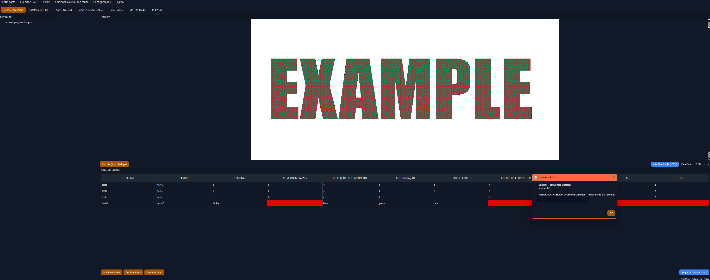

# 🖥️ Engineering Dual-Pane Productivity Tool

**Case Study – Desktop Application for Engineering Workflows**

---

## 📌 Overview

This project represents a **case study of a desktop productivity tool** designed to improve engineering workflows by synchronizing **technical drawings** and **structured data** side by side.

The tool was created to reduce context switching, improve understanding, and drastically shorten onboarding time for new team members.

> ⚠️ This repository contains a **demonstration version** and documentation only.  
> No proprietary data, company identifiers, or production code are included.

---

## 🚩 Problem

Engineering teams often work with:
- Large technical drawings (images, schematics)
- Complex spreadsheets or structured datasets
- Multiple tools and windows open simultaneously

### Before the tool:
- ❌ Constant context switching
- 🧠 High cognitive load
- 🕒 Long onboarding time for new engineers
- 📉 Reduced productivity and understanding

---

## ✅ Solution

I designed and implemented a **dual-pane desktop application** that:
- Displays technical drawings on one side
- Displays structured data on the other
- Keeps context aligned visually and logically
- Enables faster interpretation and decision-making

The tool was designed with **clarity and usability** as top priorities.

---

## 📈 Impact

- ⏱️ Reduced task execution time by **~50%**
- 🎓 Enabled new engineers to become productive after **~1 hour of training**
- 🧠 Improved understanding of complex engineering artifacts
- 🔁 Reduced dependency on senior engineers for onboarding

---

## 🧠 My Role

- Sole developer
- Desktop UI/UX design
- Architecture and implementation
- Iterative UX improvements based on user feedback
- AI-assisted development to accelerate coding and refactoring

---

## 🧰 Tech Stack

- **Python**
- PySide6 (Desktop UI)
- pandas
- openpyxl
- Desktop-first architecture

---

## 🖼️ Screenshots

---

## 🔒 Legal & Confidentiality

This project is shared as a **technical case study**:
- No proprietary assets
- No production datasets
- No company identifiers

---

## 🧭 Why This Matters

This case study demonstrates my ability to:
- Design intuitive desktop applications
- Optimize real-world workflows
- Reduce onboarding friction
- Deliver production-grade internal tools
